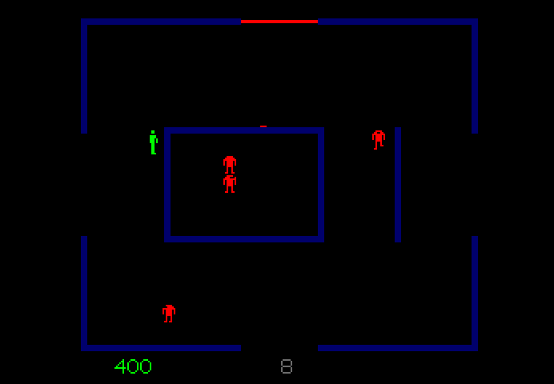

## Blog #01 - Arcade Games

Recently, I was snooping around Internet Archive's emulation arcade and came across a neat game called Berzerk, released in the 80s. The premise is that you're a stickman trapped in a labyrinth, surrounded by robots trying to eliminate you. 
You can move around and fire projectiles to destroy the robots for points, or you can simply ignore them and move into another room filled with more robots. If you take too long in a room, a bouncing smiley face follows you around. Touching the smiley kills you and this smiley is unkillable, phasing through walls and projectiles like a vengeful spirit.

While the concept of Berzerk is simple, it's actually very fun and fast-paced.
Touching a robot, getting hit by a projectile, running into a wall, or coming into contact with the deadly smiley, these are all ways to die in the game.
As such, positioning and learning how to dodge is a very important gameplay aspect. It's also important to know when to bail into a different room. 
When there are more than 5 robots on the screen, the game quickly turns into a bullet hell where you need to make multiple pixel-perfect dodges and counterattack at the same time.

Quick thinking and decision making is key in Berzerk.

 

Like many games during this time, the original controls consisted of a joystick and a button. Unfortunately, I don't own a joystick so I had to make do with playing the game on a keyboard. 
On the keyboard, the controls for movement are the arrow keys and the 'fire projectile' button is left control. Personally, I felt restricted with this setup. 
The primary reason is that firing diagonally in Berzerk is one of the most powerful moves you can do. Since robots are slow to dodge, firing an accurate diagonal shot ensures an easy kill. If a robot fires diagonally at you in a similar fashion, it's much easier to dodge. 
Since it was hard for me to shoot diagonally on keyboard, it forced me to often fight robots head-on and fire straight ahead or above and below. Despite these control mishaps, the game was very enjoyable. It really makes me wonder what my experience would be like on the original hardware. 
Would I have really been better on a joystick or would it have been harder? 
