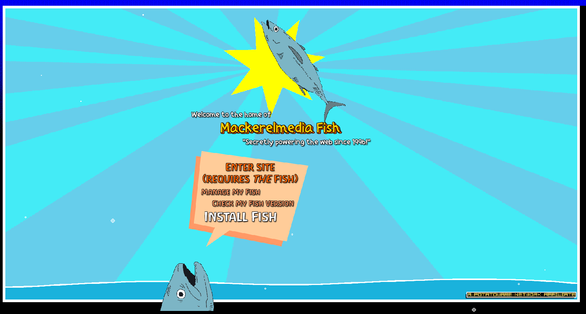
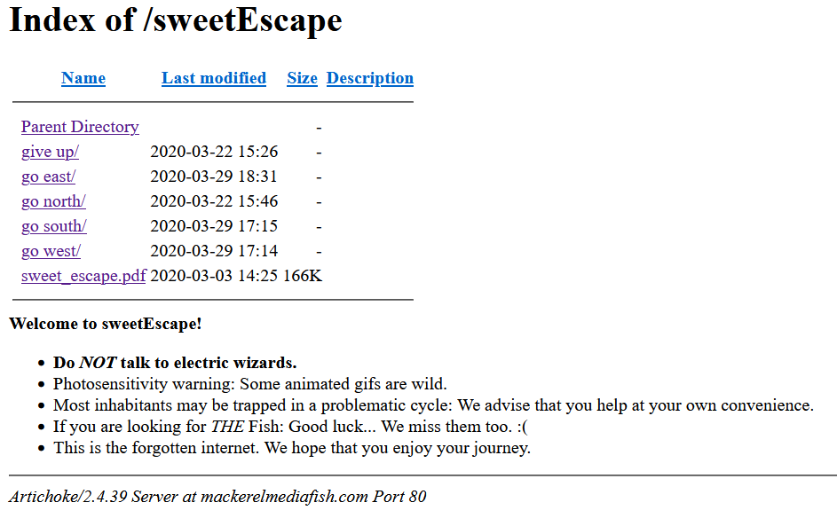
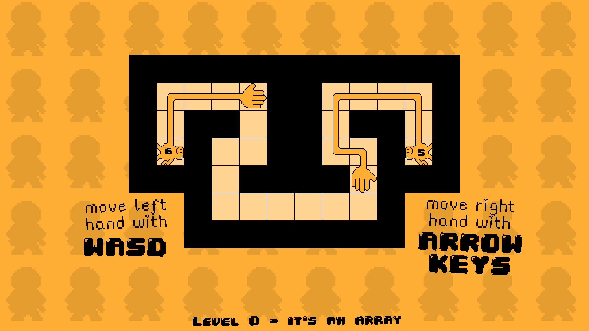

## Blog #04 - A Brief Look
In this post, I'll be giving a brief look over three interesting games that I found. These games may not be the best but they bring some unique takes on the genres that they're in.

### Observing Vs. Playing
Before we dive into the games, I would like to first write about the differences between observing someone play a game and actually playing it yourself. 

When you play a game, you experience it the way that it's meant to be experienced. Of course, there are some exceptions to this but most games are created with the assumption that people are going to play it. Personally, I feel that this is the best way to experience a game for the first time but there are also some good reasons why you should observe others play.

When you observe a game, you experience the game in a different perspective. Since you aren't currently playing the game, you can take a step back and notice details that the player may not notice. Observers have the freedom to not focus on the main mechanics of the game, looking at the bigger picture instead. This is very useful when creating games because you can see how players interact with the game and their reactions. It's also very entertaining because . . . you can see how they interact and their reactions.

If you're a first-time game purist, I recommend you play the games I list down below first before reading my review. Of course, there is no shame in reading before you jump in and spend time on a game as well.

### [This Is the Only Level](https://armorgames.com/play/4309/this-is-the-only-level)

This Is The Only Level (TITOL) is a puzzle platformer game with a very intersting take on the platforming genre. In TITOL, there is one level and the map of that singular level does not change. The goal of the player to reach the end of the level never changes either.

To keep the gameplay interesting, TITOL instead changes up the rules on how the game is played. Every time you enter a new stage in TITOL, there is always something familiar (the map) and something different about the game (the rules). It could be changing how you move in the game, or maybe altering how the physics systems work. The first try of a stage is always spent trying to figure out what the new rules are.

A very fun game that kept me thinking.

### [MackarelMediaFish](https://alienmelon.itch.io/mackerelmedia-fish)

MackarelMediaFish is a weird hybrid of a text-adventure and a website. Described as a 'ARG-like text adventure,' MMF is a text adventure that is not afraid to go overboard in presentation.

The most interesting part of MMF is how it vividly evokes feelings of nostalgia from early 2000s websites. There are hyperlinks, classic Times New Roman font, realistic gifs mixed with cartoonish ones. At some point, you even click through the website by going into where its stored and just clicking into directories. There is barely any cohesion in the presentation and that's what makes it so great. It perfectly mimics the feeling of super old websites where professional web design didn't exist and everything was barebones.

It's a wonderful experience. I'm not really sure of its genre but it's definitely unique.

### [Handshake](https://petpumpkin.itch.io/handshakes)

The last of the three games to look at is Handshakes. It's doesn't bring as much uniqueness to the table compared to the other two but it still caught my eye. Handshake is a puzzle game where you control two hands. The goal is to connect those two hands in a Handshake using a limited number of moves. 

Compared to other puzzle games where you simply go from point A to point B, Handshakes changes these rules up where you move the points instead. In the game, you are able to control both hands using two sets of controls. It's a singleplayer game where you control two sets of characters at the same time!

A cute game with neat puzzle mechanics.

## Bringing it all together
The games I went over in this post have all one theme in common. They are all games which attempt to redefine the genre that they're in. This Is the Only Level is platformer that doesn't change its platforms. MackarelMediaFish is a text-adventure that's artistic and interactive with pictures. Handshakes is a puzzle game where you move the goals towards each other. 

These games may not be perfect, they may even be forgotten, but it's important to realize that all these games innovated on their genre in some way. We should embrace change. Take from the good and leave the bad. If we never developed new ways to play, we'd probably still be playing Pong.