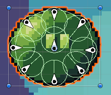

## Blog #05 - Creating a Game Prototype
For the past few weeks, I've been creating a game called *A Slime's Small Adventure*. During this creation process, I had many first time experiences as a beginner artist and game designer. Before going into this post, it should stated that I am not an artist. Prior to this game, I had zero experience with making pixel art and had no idea how to be artistic *at all*. My journey going from programmer to artist is detailed here.
#### Small Update
[The Prototype is out! Check it out in Blog 6!](../Blog6/blog6.md)

# *A Slime's Small Adventure*

## The General Idea
When starting this project, there was nothing but just me (artist) and my partner (programmer) brainstorming ideas for a fun game. After a few minutes of bouncing back and forth, we eventually settled with a platformer game as those are generally the most straightforward to develop. However, that single genre was all we had. We knew we had to create a game in Unity but we were a little lost. What would our main character look like? What about the environment? So many questions, and the biggest of them all: Would I (a first time artist) even be able to draw the ideas that we have?

It was then that I stumbled upon the amazing idea of making our main character a slime! Formless and easily colored. You may recognize this creature from other games like Dragon Quest or Terraria. With a slime as the main character, I could draw anything and it'd still look like the blob that we know and love. From this single idea, I began drawing and animating. I watched videos from pixel artists and my art evolved rapidly in just a few days.

I eventually hit a roadblock which was animating 'realistic' movement for a slime. If you didn't know, slimes are very **very** squishy. Sometimes they're even described as having the properties of both a liquid and a solid. While this is pretty easy to draw as a single photo in pixel art, animating a creature that moves like a liquid is a massive pain.

 

And so, another incredible idea came down. What if we made our slime a soft-body object? Rather than animate the slime myself, what if I just have the game engine do it for me? 

## The Crunch (& trimming of ideas)
This single idea of softbodies became a force multiplier for me as an artist. While my programmer focused on getting a rigid object in Unity to become squishy and soft, I could focus my entire attention to everything else art-related. Backgrounds, shading, tilesets, there was so much to do. In fact, there was too much to do. During this crunch time, we had to cut out many ideas that were simply not feasible to do in the time we had.

Here are some of the many ambitious ideas that we cut out:
- Combat (along with the sub-mechanics of:)
  - Enemies
  - Health
- Splitting
  - Multiple Slimes to Control
  - Complex Puzzles
- Different environments
- Dragon Boss?!?!?!!?
- Stealth

After these ideas were trimmed, the development of the game went way smoother. The type of game that we eventually settled on was a Puzzle Platformer game where you control a slime and explore. In terms of art requirements, there wasn't too much. The background, the tileset, and the slime were the main artworks that I focused on. The final results of this artwork is shown below. Compared to when I first started, I'm very proud of the progress that I made.

## Playtesting!!!

At the end of our game development journey, we finished with an alpha build of the game that was actually playable. Despite it's bugs, the game and the art was pretty well-received by the playtesters. The general playtest process for the game was as follows:
1. Game is introduced by designer (no info on mechanics)
2. Player plays the game blind
3. After finishing the game, the player provides feedback

To go more in-depth, I'll be walking through how two of the playtests went.

### Tester 1
During the first playtest of the game, the player immediately learned how to move and explored the world. At first, they jumped from platform to platform. Then, they realized they could jump infinitely many times in the air and glided through the tutorial stage easily. After the playtest, the player provided the following feedback:
- The art is pleasing to look at.
- The slime could be just a little bit squisher.
- Reduce the number of jumps to just one or two.

### Tester 2
The second playtest of the game was much different from the first one. In the second playtest, the player did not realize that they could jump an infinite amount of times in the air. So, the player tried to jump across obstacles and kept failing because they thought they had only one jump. After a few minutes, the player developed a strategy where they could use the squishiness of the slime to 'hook' onto the sharp edges of the platforms and climb up that way. This moment particularly stood out to me because I realized that the game could further cement that the fluidity of our slime by adding obstacles that could only be solved by using the properties of a squishy object. After the playtest, the player provided the following feedback:
- Jumping again immediately after landing should raise you a little bit higher than before.
- The game should be more forgiving on failing jumps.
- Art is nice.

## Moving Forward
The feedback recieved from these playtests were very insightful and it made me realize how different types of people think. While some may catch on to a new mechanic after experimenting one too many times, others may latch on to a single mechanic and never try to deviate from it. Instead, they may try to create strategies from the limitations of following that single action. To make sure that every player understands the mechanics thoroughly and what they can do, I think that I need to work a bit more on the design of the levels. The tutorial of Cuphead comes to mind where you can only progress until you learn how to use a mechanic and combine it with others. I want to make a tutorial that doesn't tell you what to do and lets you struggle until you figure out how to get through the challenge.

Moving forward, I think that I'll also start to implement the ideas that the players suggested. Even though there isn't much time left to complete this project, the ideas of the players in the playtests weren't entirely new mechanics but rather improvements on the mechanics that already exist. This means that it shouldn't be too hard to add their ideas to the project. Off to work!