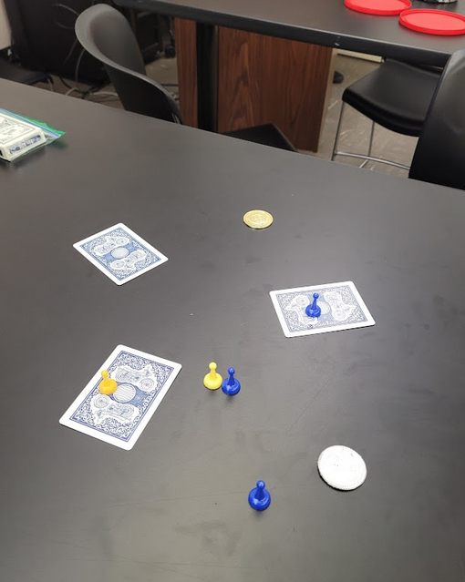
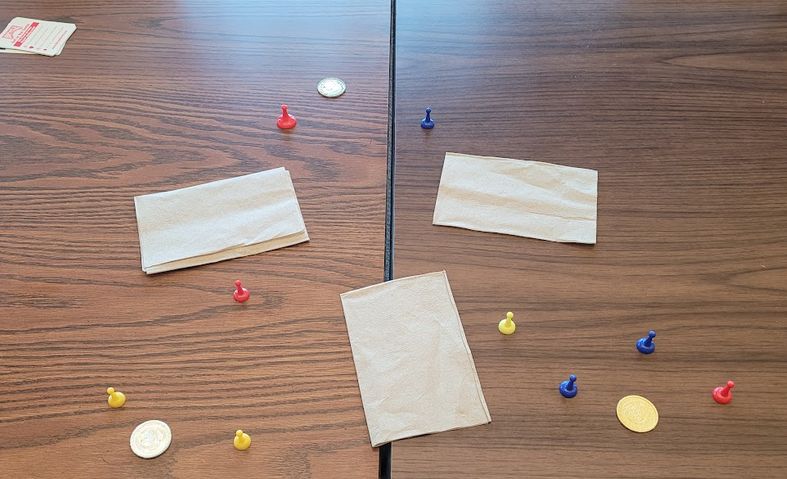

## Blog #03 - My Own Game
# Takeover
Have you ever thought about what would happen if you introduced even more strategy to Rock Paper Scissors? Well, look no further. I have made a game that has accomplished just that.

Takeover is a game which brings back the classic game of Rock Paper Scissors with a more strategic and boardgamey look. In Takeover, players control sectors that are separated by checkpoints. These checkpoints have both offensive and defensive benefits to those that occupy them. Players also control pawns which can capture checkpoints, takeover other sectors, and duel enemy pawns in bouts of classic RPS!

Hooked yet? This blog serves as a simple showcase for the development of Takeover. Here, you'll see the result of how three playtests shaped the rules of the game.

**Keep an eye on the bolded rules**

## The Beginning

### Rules
Takeover started off as a game with the core mechanics of Rock Paper Scissors and Actions. At this stage of development, the game wasn't very fun and pretty unnecesarilly complicated. Still, it's here where the gameplay features of Takeover were trimmed and improved upon to become fun.

At the start of development, Takeover had the following rules:
- The map is a grid and requires a proper board
- 4-players
- **Players are in sectors and are separated by checkpoints**
- **Players control four pawns**
- **Controlling checkpoints with a pawn allows you to cross into different sections**
- Players had only one action
  - Roll two 6-sided dice and move that direction
  - If a player's path intersected with an enemy pawn, they could attack
- **Attacking in Takeover forces the enemy player to play RPS with you**
  - The victor takes the loser's spot on the board and the losing pawn is removed from the game
- **If a pawn reaches your base, you and youre pawns are removed from the game**
- **The win condition is to be the last one standing**

### Gameplay
Takeover v1 was simple to understand but not very fun. One issue that was found was that movement was not balanced in the game. Depending on how good the player's rolled, they either completely wiped out an opposing player with a few rolls or did nothing in the round.

An example of how crazy rolls ruined the game balance is simulated below:

*The game begins with four players*
* Player 1 rolls two 2s, they do not reach a checkpoint
* Player 2 rolls two 4s, they place a pawn on a checkpoint facing Player 3
* Player 3 rolls two 6s, they rush through Player 4s sector and duel a defending pawn
  * Player 3 wins the duel
  * Player 3 captures Player 4's base using the gap made from the duel
* Player 4 has no turn, they died immediately

### Development Thoughts
Development of Takeover v1 can best be described as rushed. There wasn't really enough time to test how all the rules worked together and the game ended up as a mish-mash of mechanics that didn't seem to fit well. The primary reason for that was the hex-grid rule. Since the game was developed as a paper prototype, a large amount of time was spent on drawing hexagons on the map rather than actually testing.

Still, the game had potential. It just needed a lot of work. And so a lot of work was given.

## Big Changes

### Rule Changes
In the second bout of development for Takeover, many rules were cut and a few new rules were added. Some rules were also kept but modified slightly. These changes to the game not only made it play better but also easier to setup and understand.

For Takeover v2, the new rules were as follows:
- **The map is just split into sectors (NO HEX GRIDS)**
  - Each player controls a sector which is bordered by two checkpoints
  - The game is intended for 3-4 players
- **Players start with three pawns**
- **Controlling a checkpoint allows you to move a pawn into the adjacent sector.**
- **Players have three possible actions:**
  
  1. Move (Into different sectors or empty checkpoints)
     - Multiple pawns can be on a checkpoint
  
  2. Attack (RPS Duel)
     - **When attacking a checkpoint, defenders win ties**
  
  3. Takeover 
     - If there are no enemy pawns in a sector, you can capture a base if it hasn't been captured yet.
     - **Capturing a base replenishes all of your units along with an additional unit**
- **The last one standing wins**

Additionally, setup in Takeover v2 was changed so that every player controlled a checkpoint at the start of the game.

### Gameplay Changes
After the first revision of Takeover, setup was a lot easier. The removal of the grid-based movement system in favor of a action-based (no luck) movement system made the game much fairer and faster. Additionally, giving players the choice of three different actions on their turn, each with its own set of rules, made the game much more strategically interesting than just constant RPS duels. 

Another rule that added some complexity to the game was the *Pawn Replenishment Rule* on base capture. This rule rewarded aggressiveness and RPS skill by giving rewards to players that hunted bases.

### Flow

The most significant rule that changed how the game felt was the addition of two rules, *checkpoint defenders win ties* and *every player owns a checkpoint on start.* These rules introduced the dynamic of Flow to the game, the general direction in which combat is encouraged.

With the new rules, the importance of checkpoints rose rapidly. It's much harder to conquer a checkpoint that an opponent owns (going against the flow). Instead, it's easier to go with the Flow of combat and invade a sector that's adjacent to a checkpoint that you already own.

That's not to say that going against the flow was a death sentence though. If you managed to occupy an enemy checkpoint, it would establish a new Flow that favored you.

### Development Thoughts
It's this first revision of the game where I started to see a lot of potential in Takeover. Removing the grid board made the setup so much easier as shown in the picture above where playing cards were used as sector separators. The dynamic of Flow was also fun to play around with and I could see a lot of strategies forming around either following the Flow or going against it.

## Polish

### Rule Changes
In the second revision of rules, only minor changes to the rules were added to help improve upon the newfound dynamic of Flow in the game.

The changes are as follows:
- **Only one pawn can be on a checkpoint at a given time**
- **Players do not control a checkpoint at the start of the game**
- **The turn order is clockwise but Flow can be in any direction**
- **Two Win Conditions**
  
  1. **Last One Standing**
  
  2. **Control All Checkpoints**

The full set of the rules can be found [here.](https://docs.google.com/document/d/17f8A_u-n2co6ALROVF-oOLZlbsD-QDHRrPCDBazV-G4/edit?usp=sharing)

### Gameplay Changes
The slight changes in the rules made Flow much more malleable by allowing the first player in the turn order to decide the direction of the Flow. Also, the rule limiting checkpoints to only one pawn forced players to attack rather than reinforce, leading to a more action-packed game. Overall, these changes were small but were very much needed.

## Final Thoughts
As a whole, I really enjoyed creating Takeover. It was my first "real" boardgame and while it does have its flaws, its pretty fun once you get the hang of things. One thing that I'd like to try in the future is to substitute the Rock Paper Scissors mechanic with something else. I wonder how the game would change with a dueling system that's different from RPS.
