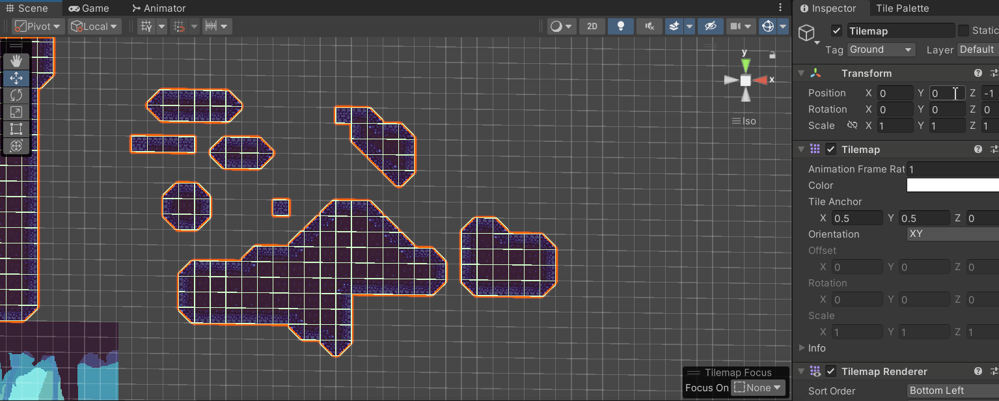
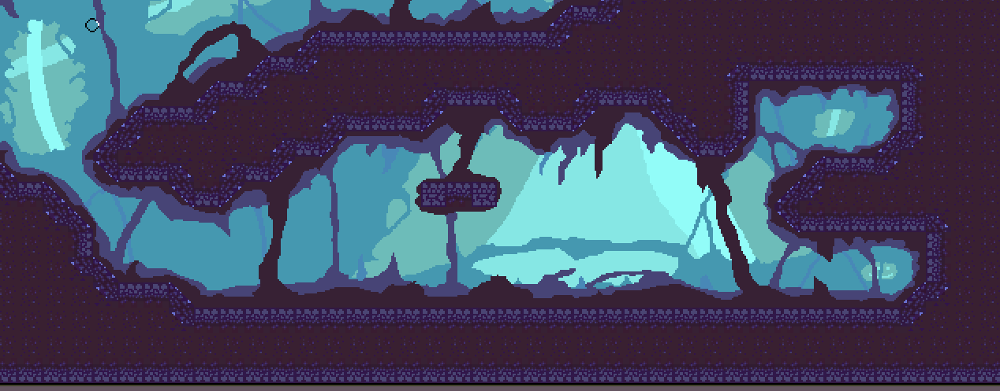
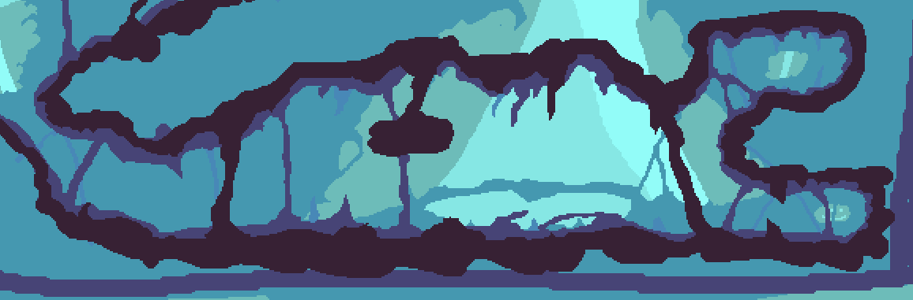
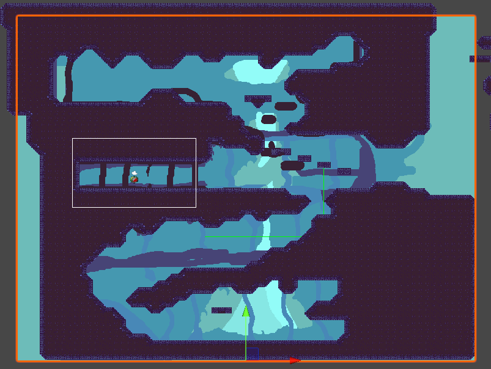
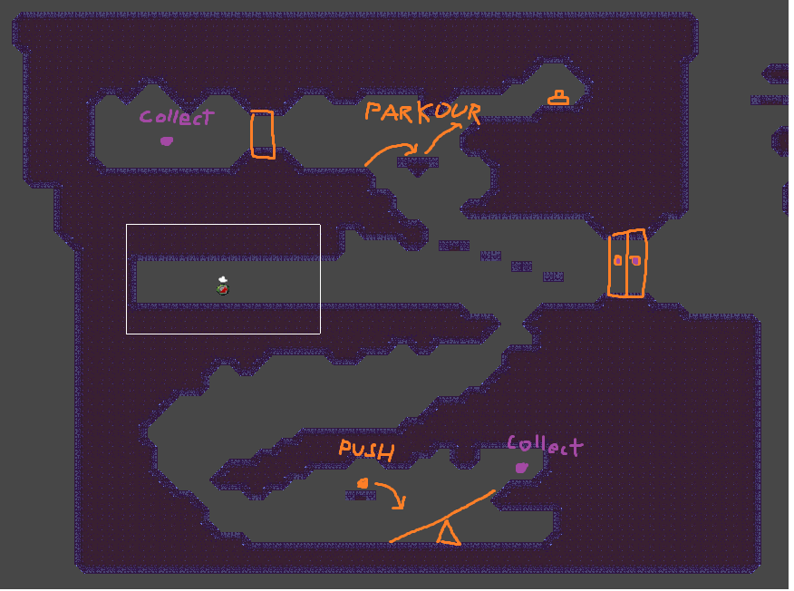

Hello again! This blog is a continuation of [*A Slime's Small Adventure - A Finished Prototype*](../devlog-2) and goes over the progress that's been made on A Slime's Small Adventure since its prototype. Around a month has passed and development on the game's second level has been steadily chugging along. The entire workflow process around art and level design has also changed.

## The Second Level
### Workflow Change

Before going into the design of the second level, I'll first go over some workflow changes that I made which allowed me to make Level Two a lot better than Level One. 

The first large change to my workflow that's helped with level design has been the implementation of Unity's Rule Tile feature. With this feature, you're able to add 'rules' to the placements of tiles. If a tile satisfies the given rule, it'll automatically assign the appropriate texture to the tile. At it's current state, it's a little tricky to work with because it doesn't play with regular tiles nicely but it's substantially increased the speed at which I can create and test levels. What's also pretty neat about it is that it can automatically rotate the tile that its given which has cut down on the number of tiles that I've needed to make.
____________

Another change to my workflow is the way that I approach creating the backgrounds to my levels. In the past, I just created backgrounds of a general size and didn't really care too much about it fitting with the tiles on the level. My new process is as follows:

1. Export TileMap to a PNG
2. Open Tilemap on Aseprite and erase unnecessary objects
3. Draw background using the TileMap as reference.
4. Drag Aseprite file onto Unity Scene. Now, every time I save a change on Aseprite, it's reflected onto Unity!

With this new strategy, I'm able to create backgrounds that better fit the tiles that the players actually stand on. Some of my inspiration came from how Hollow Knight does things where every piece of scenery is unique and drawn onto the tiles. One big downside about this method of drawing backgrounds is that it takes a **lot** more time than before but for a small project such as this, I think it's fine.

### Level Design

Now onto the level design! One aspect of Level Two that sets it apart from Level One is its verticality. In this level, I really wanted to make a stage where I could experiment with art and design patterns to try and guide the player to where I want them to go. 

The picture above shows an initial draft of the art for Level Two. One part of this draft that I'd like to highlight is the giant pillar in the center of the level that peeks from behind the background. I'm not really an expert on game design but I feel like it does a good job at conveying the verticality of the map. I also think that it somewhat 'guides' the players to either go up or down. When you first start the level, the player moves into a central chamber which highlights the pillar in its entirety and gives player two choices: go up or go down. I don't know if the pillar actually convey these ideas to a player but I'm proud of my giant pillar because it looks cool. 

### New Puzzles

In Level Two, there are two puzzles that a player must complete to finish the level. The first is a basic button puzzle that requires the player to have some finesse in jumping. The second puzzle is a new one, called the Lever Puzzle.

In this new type of puzzle, it utilizes the concepts of a lever (think seesaw!) and relies on Unity's Physics engine to work. It's not a particually hard puzzle to understand since all you need is a basic grasp of how a seesaw works but I feel like it'll really open up the gateway to more complex puzzles in the future.
 
### New Camera System

The vertical design of Level Two required some tweaks to the Camera system. With the new camera, it'll lock onto specific areas of interest when the player gets close enough. It also stops the camera from going outside of the map by allowing it to move independently from the player (stops followng when player approaches a wall). As of now, it's not the best that it can be but I think it does a good job of guiding players towards places that they need to go.

## Reflection
Overall, the development of Level Two seemed like a lot more work than the previous level but it was very fun! I learned even more about how art is composed and how level design can be used to encourage certain actions to be taken. Even if I don't continue this game to a third level, I'll have come out of it with a lot of neat knowledge about game design.